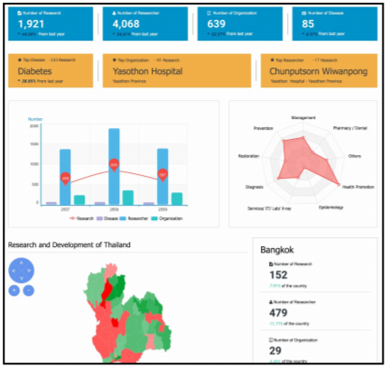
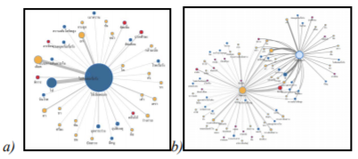
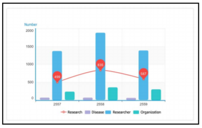

# Week 14 - MedThaiVis: An Approach for Thai Biomedical Data Visualization 

Mitrpanont J, Janekitiworapong N, Ongsritrakul S, et al. MedThaiVis: An approach for thai biomedical data visualization[C]//2017 6th ICT International Student Project Conference (ICT-ISPC). IEEE, 2017: 1-4.

Biomedical information is highly complex,
scattered in all areas, and difficult to present therefore the
medical and public health practitioners or professionals who are
working with these data are required to interpret numerous
biomedical data sets. Moreover, these data are vital, abundant
and change at any time. With the proper tools and guidelines to
visual this information, the knowledge sharing and disseminating
are increased among the health practitioners, experts and
decision makers. It also helps to release some load of works from
the experts who are required to interpret each data set which not
only very time-consuming but may also miss critical findings
from these complex information. 

This paper proposes an effective approach of data visualization to 
manage and visualize biomedical information of the R2R Thailand project. 
It provides the following 4 techniques support various type of visualizations.

1. Dashboard  
2. Medical and Healthcare Map
3. Multi-relationship Network 
4. Statistic Graph. 

The result of the proposed approach yields 87.33% for the average
correctness of the meaning interpretation and understanding
which is satisfactory and effective for biomedical information
knowledge sharing. From my perspective, this paper is very impressive,
because it provides an efficient solution to visualize complicated
biomedical data by making use of several data visualization techniques.
More important, this project benefits both medical stuffs and patients.
It solves real world problems. Thus, I think it worth to be shared with
my classmates.

*figure-1 An example of dashboard*

*figure-2 An example of medical and healthcare map*

*figure-3 An example of multi-relationship network review*

*figure-4 An example of statistics graph*
