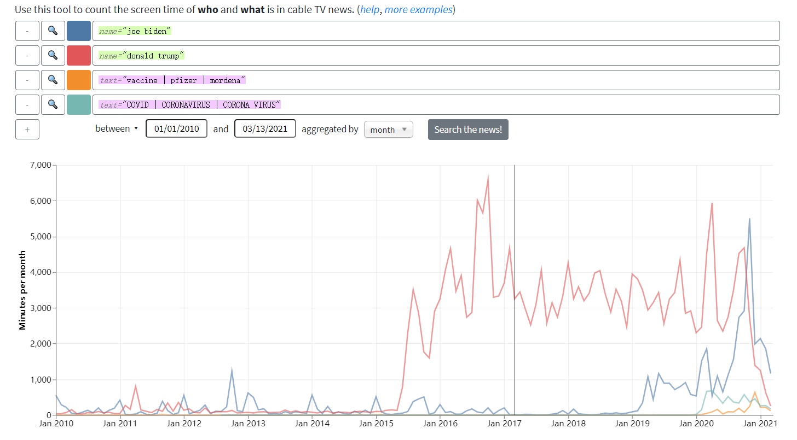

# Week 6 Reflection

Resource link: [Stanford Cable TV News Analyzer](https://tvnews.stanford.edu/?dataVersion=v1&data=eyJvcHRpb25zIjp7ImFnZ3JlZ2F0ZSI6Im1vbnRoIn0sInF1ZXJpZXMiOlt7ImNvbG9yIjoiIzRFNzlBNyIsInRleHQiOiJuYW1lPVwiam9lIGJpZGVuXCIifSx7ImNvbG9yIjoiI0UxNTc1OSIsInRleHQiOiJuYW1lPVwiZG9uYWxkIHRydW1wXCIifSx7ImNvbG9yIjoiI0YyOEUyQiIsInRleHQiOiJ0ZXh0PVwidmFjY2luZSB8IHBmaXplciB8IG1vcmRlbmFcIiJ9LHsiY29sb3IiOiIjNzZCN0IyIiwidGV4dCI6InRleHQ9XCJDT1ZJRCB8IENPUk9OQVZJUlVTIHwgQ09ST05BIFZJUlVTXCIifV19)

The Stanford TV News Analyzer has applied deep-learning-based image and audio analysis processing techniques to nearly a decade of 24¨C7 broadcasts from Fox News, CNN, and MSNBC going back to January 1, 2010. That's over 270,000 hours of video updated daily. Computer vision is used to detect faces, identify public figures, and estimate characteristics such as gender to examine news coverage patterns. To facilitate topic analysis the transcripts are time-aligned with video content, and compared across dates, times of day and programs.

